# C3 User Data Management Dashboard Application

write a description of the app

## Data Management

Test case documents can be found in the `test_case` folder.

## Demo
### Login and User Authentication
The following screenshots are the basic structure of the login portal of C3’s Web Portal.
Here is the login screen

   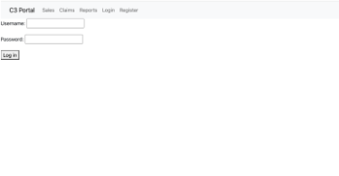

All workers can create an account using their username, first name, last name, work email address and confirming their password. 
There has also been a drop down option to clarify which department a user is a part of. 

   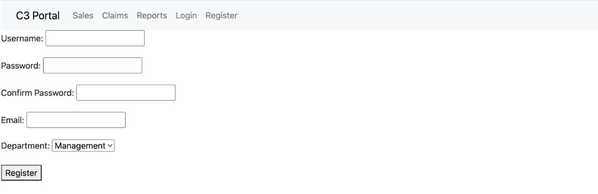

Once the account is created, you will be able to see the created account in the database.

   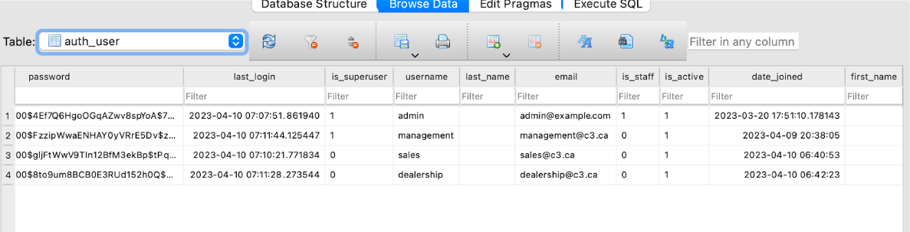

Users who already have an account can login using the sign in page. A valid username and password must be inputted. 
If there is an invalid information inputted. The user will be redirected to the main login page with the following error message

   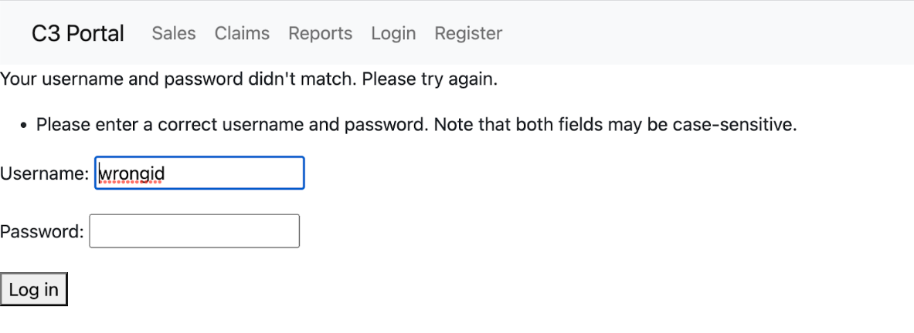

Once the user is logged in, they will be able to access the the subsystems that they were granted access for. If they are not granted permission, they will be prompted to log in. 

User authentication

   
   User with the id “sales” is under the sales department group, who can only access the sales subsystem.

   User with the id “dealership” is under the dealership department group, who can only access the dealership and sales subsystem.

   User with the id “management” is under the management department group, who can access all three of the subsystems. They will be classified as the superadmin.

| Subsystem  |                             Result                              |
| ---------- | --------------------------------------------------------------- |
| Sales      | 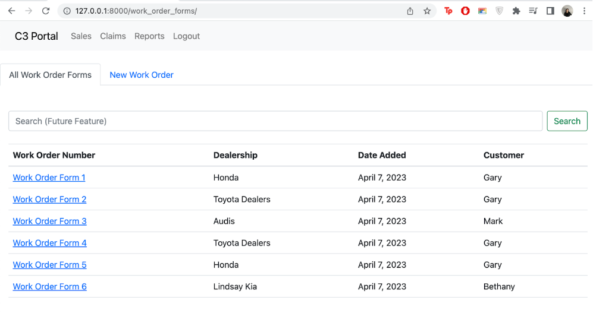  |
| Claims     | 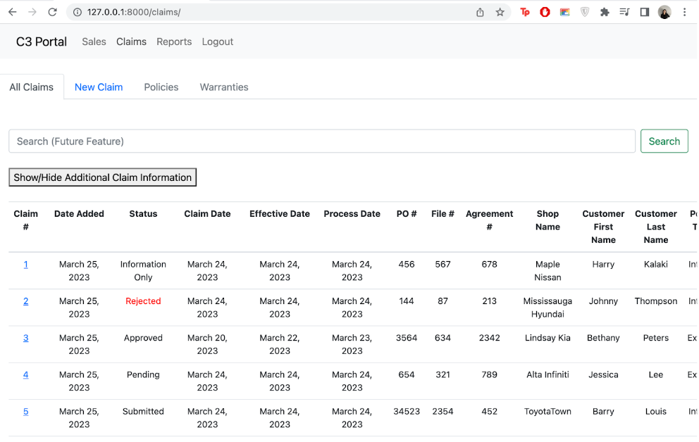 |
| Reports    | 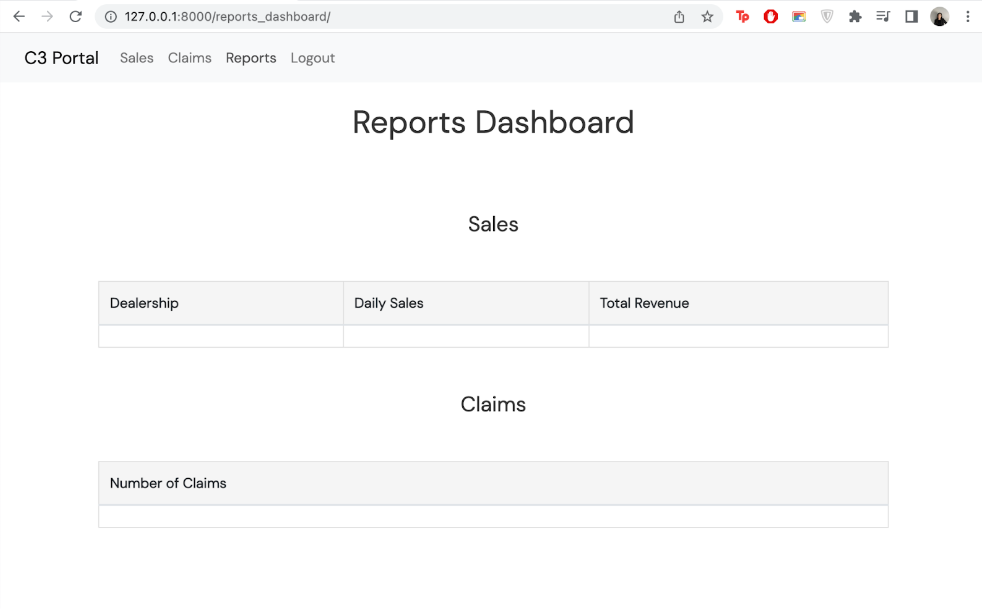|

More details are included in the pdf file "build_information"

### Sales 
The following screenshots are the basic structure of the sales portal of C3’s Web Portal. 
These images display the work order form page that dealerships will use to create a new work order form and submit into the C3 portal.
Here is a new work order form.

   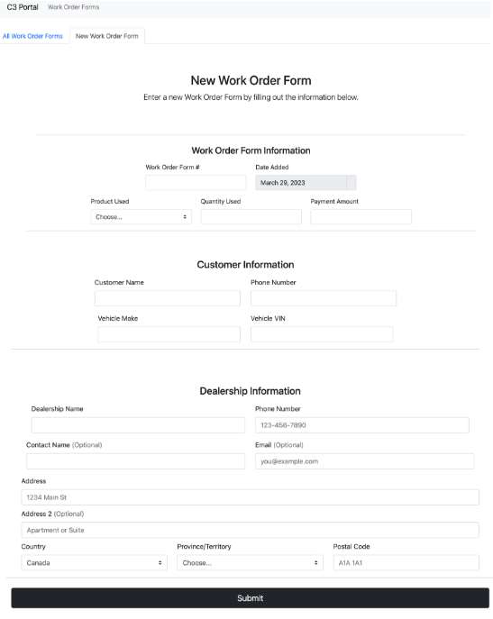

This is the homepage that C3 management will use to view all work order forms. 
Each work order form is hyperlinked so users can click on a specific form to see the exact details of each form. 

   

This is a screenshot of a specific work order form that will contain all the necessary information for C3’s sales system to function correctly. 

   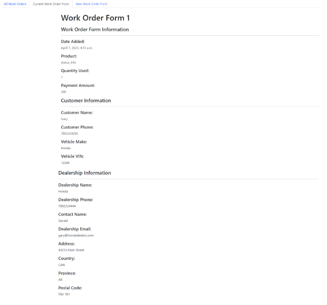

### Claims
The following screenshots are the structure of the claims in C3’s Web Portal.
Navigate to the New Claim tab to enter a new claim into the system.
General claim information can be found at the top of the new claim entry. The claim number and date added are automatically generated for each new claim. Other entries include the claim status, claim date, effective date, process date, PO number, file number, and agreement number.

   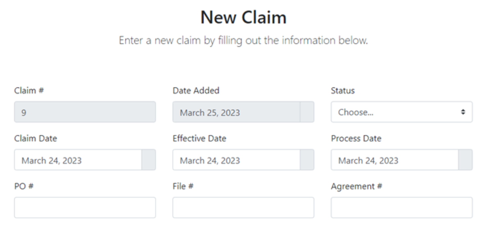

If ‘Approved’ was selected for the claim status, the approval entries are shown for the user to fill out. This section is hidden by default.

   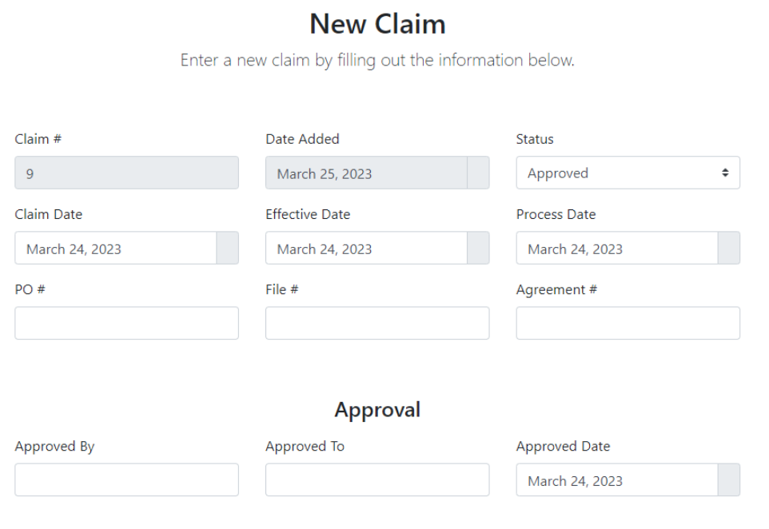

If ‘Rejected’ was selected for the claim status, the rejection entries are shown for the user to fill out. This section is hidden by default.

   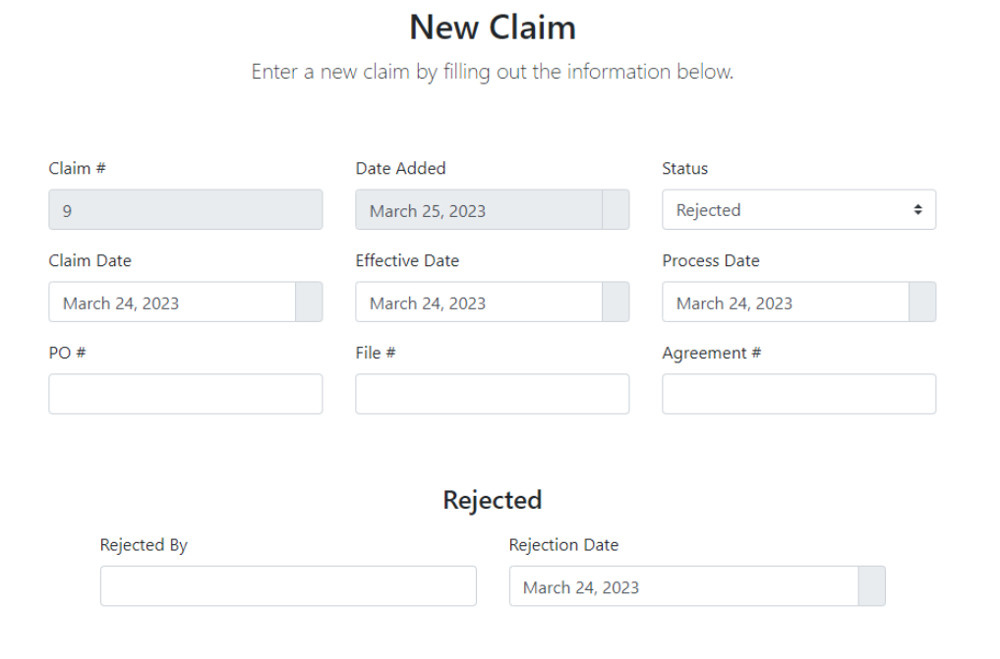

Following the general claim information section are the repair shop and customer information sections. 
The repair shop phone number and postal code automatically formats the user’s entry to the correct formats. 

   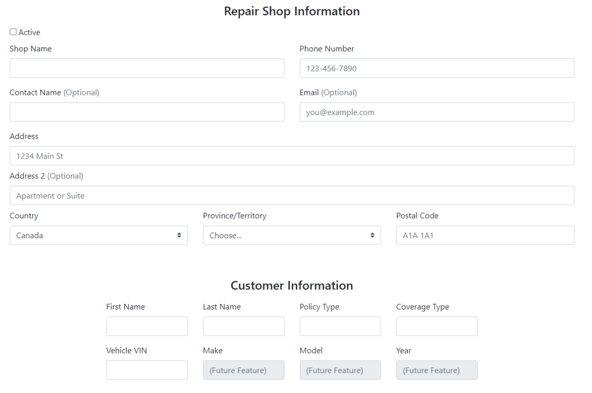

Following the customer information section, is the section to fill out the problem(s) for the claim. This section includes entries for the problem(s), a textbox to enter in a detailed explanation (textbox size can be expanded from the bottom-right corner), and a section to upload claim images to the entry. Saving the problem type, description, part, side, and goodwill to the database is in development and not implemented in this prototype.

   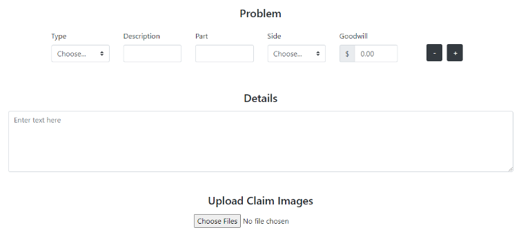

By default, only one problem entry is shown on the new claim form. The user can add additional problems to the claim by pressing the ‘+’ button. The new problem entry row appears below whichever row the ‘+’ button was pressed. To remove a problem, the user can press the ‘-’ button on whichever row they want removed. Each claim must have at least one problem, so the user is restricted from removing the last remaining row.

   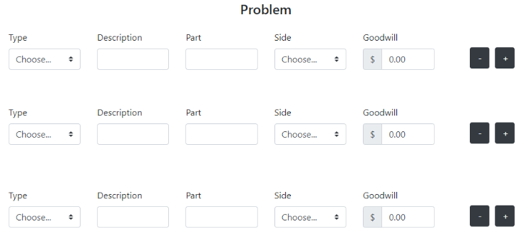

Following the problem section is the claim amounts section. This section includes the claim estimates, actual claim amounts, and payment information. The actual claim net amount is automatically calculated. This is the last section for the user to fill out so the submit button is shown right after.

   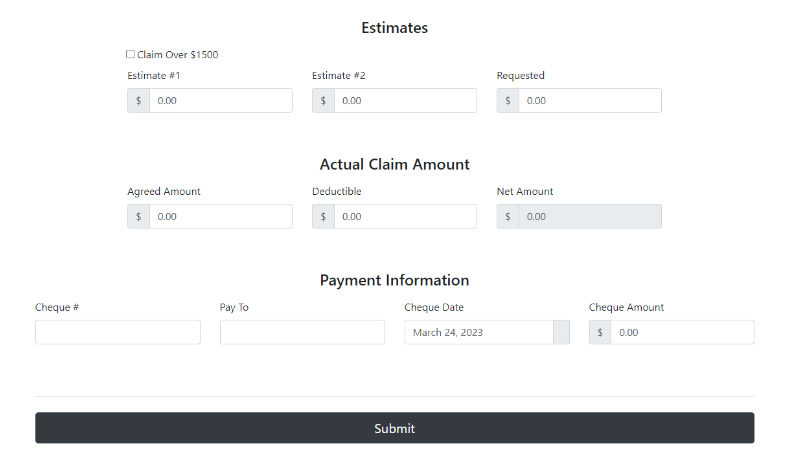

More details are included in the pdf file "build_information"

### Reports
*In order to make the graphs interactive, JavaScript would be required. However, as this functionality falls outside the scope of this project at the moment, it is still under development. 

*The export button is currently under development as the database is still being developed. Once the database is complete, the export button will be implemented to allow users to export the data from the Sales Table and Claim Count Table to an CSV file.

   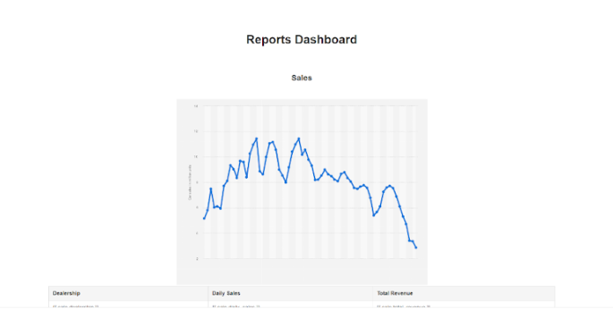

   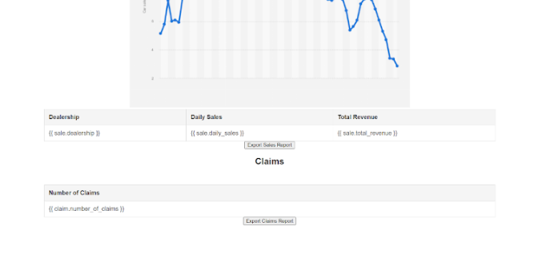

